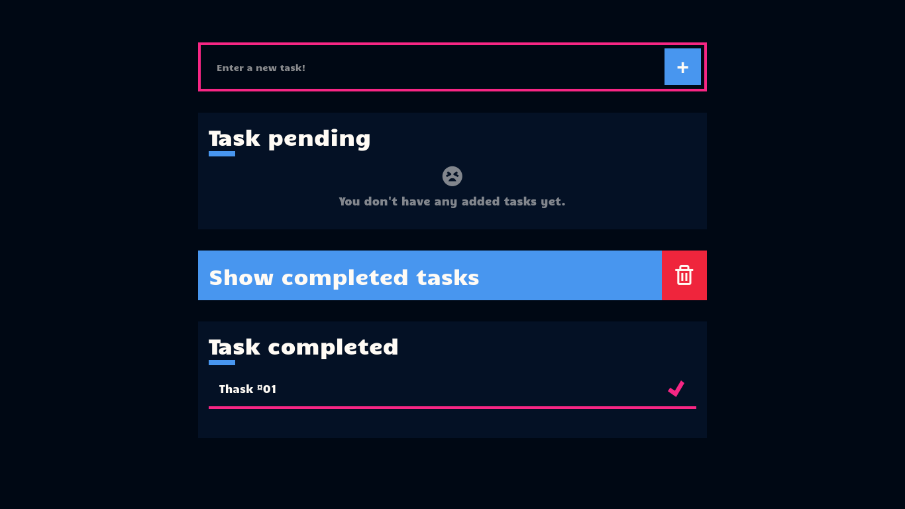

<div id="top"></div>

# Todo App
A simple Todo App created and built with ReactJS and native CSS, with an outgoing design. The objective of this project was to put my knowledge in React into practice, making use of LocalStorage and Hooks such as useState and useEffect.



[Live Preview](https://todo-app-josneth.netlify.app/)


## Dependencies

Install NPM or PNPM
* npm
  ```sh
  npm install npm@latest -g
  ```
 
  Or
  
* pnpm
  ```sh
  npm install -g pnpm
  ```


## Setup

1. Clone the repo
   ```sh
   git clone https://github.com/josnethmoreno/todo-app-react.git
   ```
   
2. Install NPM packages
   ```sh
   npm install
   ```
   
3. Start the development server
   ```sh
   npm run dev
   ```


## Build & deploy

1. Generate a full static production build
   ```sh
   npm run build
   ```
   
2. Preview the site as it will appear once deployed
   ```sh
   npm run preview
   ```

## License

Distributed under the MIT License. See `LICENSE.txt` for more information.

<p align="right">(<a href="#top">back to top</a>)</p>